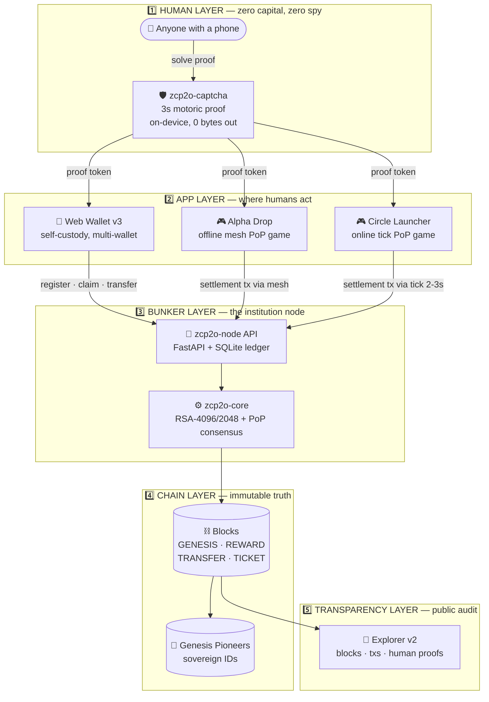
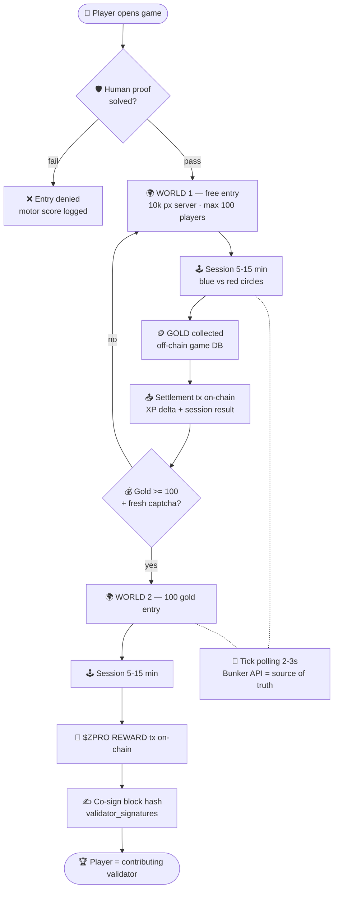

# 🗺️ ZCP2O Flowcharts

> **Visual maps of the ZCP2O ecosystem — because humans understand pictures faster than paragraphs.**

This folder holds the canonical architecture diagrams of the protocol.
GitHub renders the Mermaid sources below automatically.
Raw `.mmd` files are included for PNG/SVG export via [mermaid.live](https://mermaid.live).

---

## 1️⃣ ZCP2O Ecosystem — End-to-End

**How to read (5 layers):**
1. **Human** proves humanity on-device (0 bytes exfiltrated).
2. **Apps** consume the proof token (wallet, games).
3. **Bunker** validates & orders everything into the ledger.
4. **Chain** stores immutable truth (blocks + pioneer IDs).
5. **Explorer** lets anyone audit it publicly.

---

## 2️⃣ Circle Launcher — Proof-of-Play Loop

> 📂 **Raw source file:** [`implementations/zcp2o-circle/circle-launcher.mmd`](../implementations/zcp2o-circle/circle-launcher.mmd)

**How to read (6 beats):**
1. Entry is gated by human proof — bots are denied & scored.
2. World 1 is free: play, collect GOLD (off-chain, fast).
3. Every session settles on-chain (XP + result) — the chain stays alive.
4. 100 gold + fresh captcha unlocks World 2 (gold sink = anti-inflation).
5. World 2 pays $ZPRO via on-chain REWARD transactions.
6. Players co-sign block hashes → the game feeds SPEC-04 validators.

---

## 🖼️ Export for Social Media

1. Copy the contents of `ecosystem.mmd` or `circle-launcher.mmd`.
2. Paste into [mermaid.live](https://mermaid.live).
3. **Actions → Export PNG / SVG**.
4. Post — one picture, whole protocol, ten seconds.

---
*Locked by Ringga999 + Mr. Architect · ZCP2O Foundation*