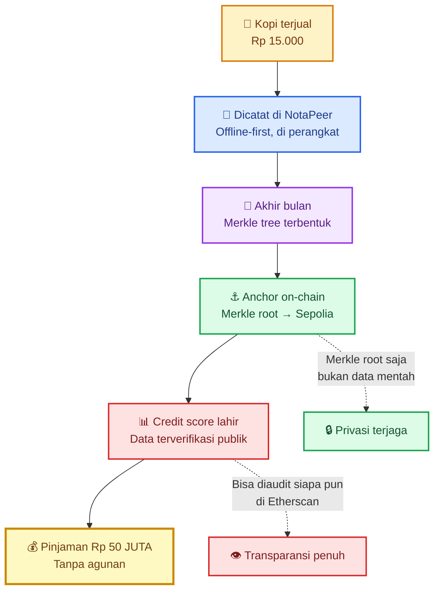

# ☕ From Coffee to Credit

> *A Rp 15,000 coffee sale unlocks a Rp 50,000,000 loan. Here's how.*

---

## 📖 The Journey (6 Steps)

| # | Step | Layer |
|---|------|-------|
| 1 | Kopi terjual Rp 15.000 | 🏪 Dunia nyata |
| 2 | Dicatat di NotaPeer (offline) | 📱 Layer 1: Local Ledger |
| 3 | Merkle tree terbentuk akhir bulan | 🔐 Layer 2: Cryptography |
| 4 | Merkle root di-anchor ke blockchain | ⛓️ Layer 3: On-chain |
| 5 | Credit score lahir dari data terverifikasi | 📈 Layer 4: Reputation |
| 6 | Pinjaman Rp 50 juta tanpa agunan | 💵 Layer 5: Financial access |

---

## 🎯 Why This Matters

- **2.6 miliar** orang dewasa di dunia tidak memiliki akses perbankan
- **Rp 0** agunan yang mereka punya — tapi punya **rekam jejak nyata**
- NotaPeer mengubah **transaksi warung** menjadi **aset kriptografis** yang bisa diaudit
- Lender bisa memberi pinjaman **tanpa takut** karena data sudah terverifikasi on-chain

---

## 📚 Related Documentation

- [Ecosystem Flow](./ecosystem.md) — the full protocol architecture
- [Circle Launcher Game Loop](./circle-launcher.md) — Proof-of-Play in action
- [WHITEPAPER.md](../../WHITEPAPER.md) — the full ZCP2O vision

---

*Built in public · Solo founder · Rp 0 modal · 23 September 2026*