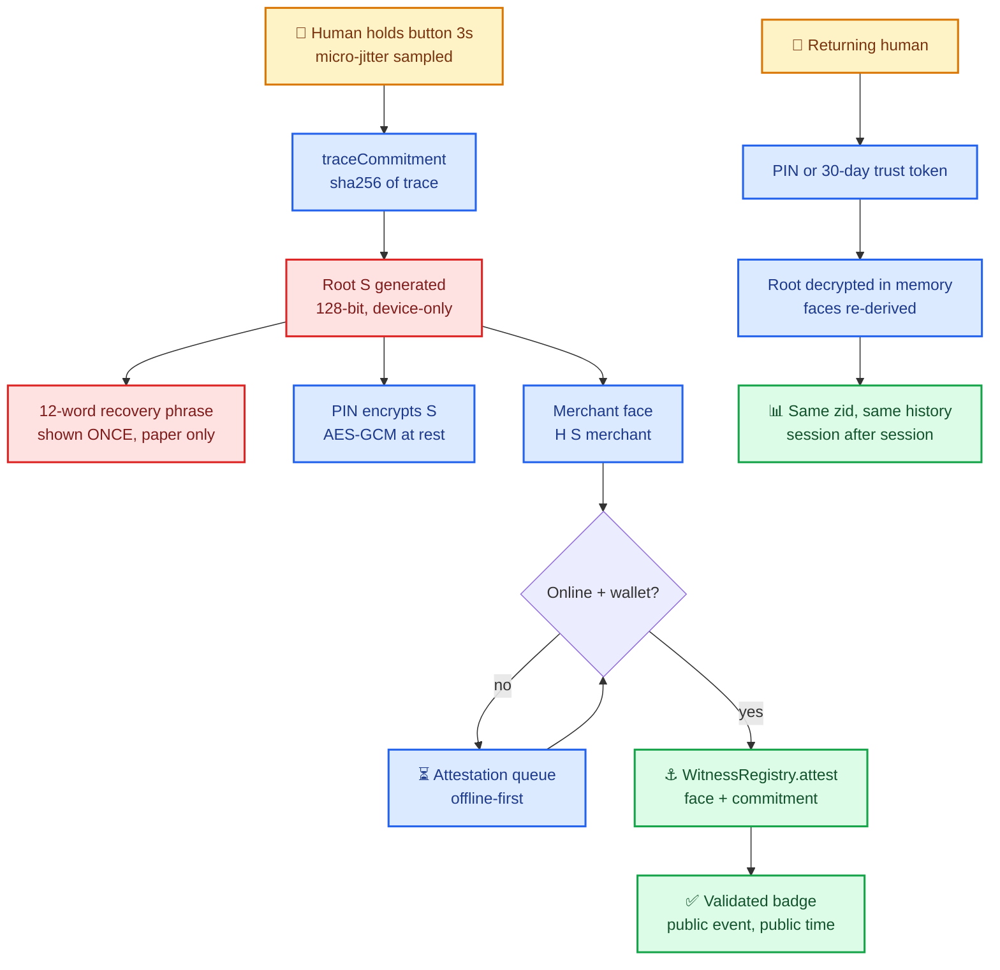

# 🔐 Identity & Attestation Flow

> *From a 3-second hold to an on-chain stamp of humanity — without leaking a byte of self.*

---

*Spec: [`specs/witness-registry.md`](../../specs/witness-registry.md) · Doctrine: `notapeer/docs/IDENTITY.md`*