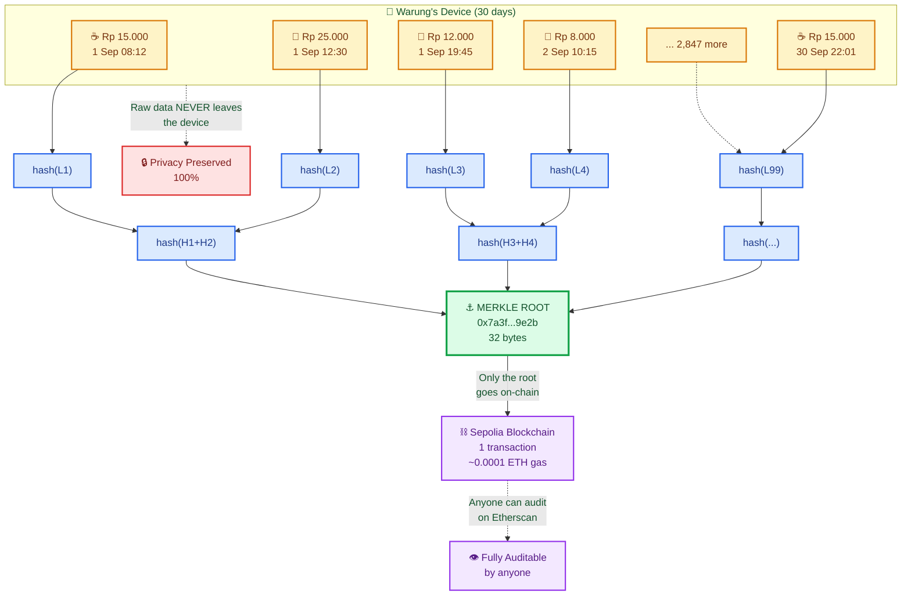

# 🌳 From 1 Million Transactions to 1 Hash

> *How a warung's entire month of transactions becomes a single cryptographic proof — without exposing a single detail.*

---

## 📖 The Merkle Magic (5 Layers)

| Layer | What | Where |
|-------|------|-------|
| 1 | Raw transactions (thousands) | 📱 Local device only |
| 2 | Each tx hashed to 32 bytes | 📱 Local device only |
| 3 | Hashes paired & re-hashed | 📱 Local device only |
| 4 | **Single Merkle Root** (32 bytes) | 📱 → ⛓️ Goes on-chain |
| 5 | Verification proof for anyone | 🌍 Public on blockchain |

---

## 🎯 Why This Is Revolutionary

### ✅ Privacy Preserved
- Raw transaction data **NEVER** leaves the warung's device
- Not a single customer name, product, or price is exposed
- Only the 32-byte Merkle root is published on-chain

### ✅ Verifiable by Anyone
- A lender can cryptographically verify ANY single transaction
- Using a "Merkle proof" (5 sibling hashes), they confirm: *"Yes, this Rp 15,000 coffee was part of the anchored month"*
- No need to download 2,851 transactions — just 5 hashes

### ✅ Cheap to Anchor
- 30 days × 100 transactions = 3,000 records
- All compressed into **1 transaction** on-chain
- Gas cost: ~0.0001 ETH (~$0.30) regardless of volume

---

## 🔍 Verification Example

> *"Did this warung really sell Rp 15,000 coffee on September 1st at 08:12?"*

**Proof needed:**
1. The transaction itself (from warung)
2. 5 sibling hashes along the path
3. The public Merkle root (from blockchain)

**Verification time:** < 1 millisecond  
**Privacy leaked:** Zero bytes  

---

## 📚 Related Documentation

- [Ecosystem Flow](./ecosystem.md) — the full protocol architecture
- [From Coffee to Credit](./coffee-to-credit.md) — the user journey
- [Circle Launcher Game Loop](./circle-launcher.md) — Proof-of-Play in action
- [WHITEPAPER.md](../../WHITEPAPER.md) — the full ZCP2O vision

---

*Built in public · Solo founder · $0 funding · 23 September 2026*