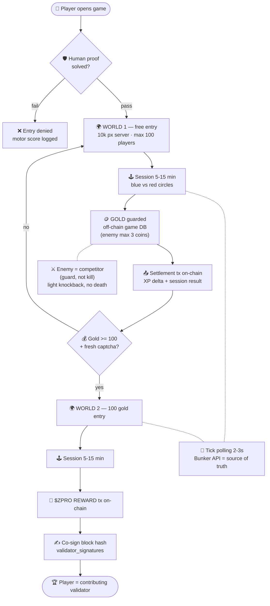

# 🎮 Circle Launcher: ZCP2O Proof-of-Play Reference Implementation

> **The Second Reference Implementation — A lightweight, addictive arcade game built in Godot 4 that turns players into contributing nodes/validators via the ZCP2O Protocol.**

Circle Launcher is a server-authoritative, tick-based 2D arcade game. It serves as the primary proof-of-concept for SPEC-02, demonstrating how casual gameplay can be cryptographically tied to on-chain validator attestations and micro-rewards, while maintaining a Free-to-Play + Ads monetization model.

---

## 🌟 Key Features

*   **Zero-Capital Entry (Free + Ads):** Players can start playing immediately. Monetization is handled via non-intrusive ad placements, ensuring fair access without pay-to-win mechanics.
*   **Dual-World Economy:** 
    *   **World 1:** Captcha-gated entry. Rewards: Off-chain Gold tokens + Silver Ticket (on-chain).
    *   **World 2:** Captcha + 100 Gold entry fee. Rewards: Gold, XP, and `$ZPRO` (on-chain REWARD tx).
*   **Server-Authoritative Tick Polling:** Designed for free-tier hosting constraints. Uses 2–3 second HTTP polling instead of WebSockets, with the server acting as the single source of truth for positions and collisions.
*   **Proof-of-Play (PoP) Integration:** Session results and XP deltas are settled on-chain. High-trust players can co-sign block hashes via the `block.validator_signatures` field.
*   **Advanced Anti-Bot Telemetry:** Session length is randomized (5–15 mins). The ZCP2O captcha motor-ness score seeds player trust; bot-like behavior results in diminished reward pools.

---

## 🛠️ Tech Stack

*   **Game Engine:** Godot Engine 4.x (GDScript)
*   **Backend Integration:** ZCP2O Node API (FastAPI) via HTTP polling
*   **State Management:** 
    *   *On-chain:* `$ZPRO` balances, Silver Tickets, Session Settlement TXs.
    *   *Off-chain:* Gold tokens, ephemeral positions/enemies, leaderboard cache (managed by Bunker DB).
*   **Monetization:** Godot Ads SDK (Android/iOS) + Web Ad Networks (WebGL)

---

## 🏗️ Architecture & Asset Mapping

To prevent chain bloat and ensure scalability, assets are strictly partitioned:

| Asset / Data | Location | Reason |
| :--- | :--- | :--- |
| `$ZPRO` reward | On-chain (`tx_type="REWARD"`) | Real economic value |
| Silver Ticket | On-chain (`tx_type="TICKET"`) | Season/achievement proof |
| Session Result + XP Delta | On-chain (Settlement TX) | Auditable validator contribution |
| Gold Token | Off-chain (Game DB) | Fast transactions, no chain bloat |
| Positions / Enemies / Ticks | Off-chain (Session Memory) | Ephemeral, high-frequency data |
| Leaderboard | Off-chain cache + On-chain checkpoint | Fast view, auditable root |

---

## 🔒 Dual-Repository Strategy

To protect intellectual property, API keys, and Play Store signing credentials, this project follows a dual-repo architecture:

1. **Public Repo (`zcp2o-protocol`):** Contains this `README.md`, design specifications (`specs/SPEC-02.md`), and API integration contracts.
2. **Private Repo (`circle-launcher`):** Contains the full Godot 4.x source code (`src/`), game assets (`assets/`), build configurations (`builds/`), and environment variables (`.env`).

*Access to the private repository is restricted to core ZCP2O Foundation developers.*

---

## 🚀 How to Run (Local Development)

*Note: Requires access to the private `circle-launcher` repository.*

1. Download and install **Godot Engine 4.x**.
2. Clone the private repository:

   ```bash
   git clone https://github.com/Ringga999/circle-launcher.git
   cd circle-launcher
   ```

3. Open the `project.godot` file in Godot Engine.
4. Configure your local `.env` file with the testnet Bunker API endpoint:

   ```env
   BUNKER_API_URL=http://localhost:8000
   ```

5. Press `F5` to run the game locally.

---

## 📈 Phasing Roadmap

*   **G0 (Current):** Specification locked + offline Godot prototype (game feel & mechanics).
*   **G1:** Captcha gate integration + tick-based sessions + `$ZPRO` rewards via existing Bunker plumbing + leaderboard checkpoints.
*   **G2:** Multi block-server sharding (max 100 players/server) + full gold economy + `validator_signatures` attestation.

---


## 🗺️ Proof-of-Play Flow

> The raw Mermaid source for this diagram lives in [`circle-launcher.mmd`](circle-launcher.mmd).



**The 6-beat loop:**
1. Entry is gated by human proof — bots are denied & scored.
2. World 1 is free: play, collect GOLD (off-chain, fast).
3. Every session settles on-chain (XP + result) — the chain stays alive.
4. 100 gold + fresh captcha unlocks World 2 (gold sink = anti-inflation).
5. World 2 pays $ZPRO via on-chain REWARD transactions.
6. Players co-sign block hashes → the game feeds SPEC-04 validators.

---

## 🎮 Game Balance Principles

Circle Launcher is designed around **fair competition, not punishment**. The following principles ensure the game remains engaging, economically sound, and aligned with ZCP2O's zero-capital philosophy.

### 1. Enemy Guard, Not Collect
Enemies **cannot** add coins to their inventory. Instead, they **"guard"** coins by standing on them. A guarded coin becomes temporarily unavailable to players until the enemy moves away.

```
Player takes coin → +1 gold
Enemy stands on coin → coin locked (unavailable)
Enemy moves away → coin unlocked (available again)
```

**Why:** Prevents "massive coin drop" scenarios when enemies are defeated. No server-side validation bottleneck.

### 2. Coin Cap per Enemy (Max 3)
A single enemy can guard at most **3 coins simultaneously**. If it moves to a 4th coin, the oldest guarded coin becomes unlocked (FIFO queue).

```
Enemy guards coin A → locked
Enemy moves to coin B → B locked
Enemy moves to coin C → C locked
Enemy moves to coin D → D locked, A unlocked (FIFO)
```

**Why:** Prevents enemy monopoly over the map. Players always have alternative coins to pursue.

### 3. Random Enemy Spawn
Each session spawns enemies at **random locations** (not fixed spawn points).

```gdscript
position = Vector2(
    randf_range(1000, 9000),
    randf_range(1000, 9000)
)
```

**Why:** No "camp spots" that players can memorize or exploit. Every session feels fresh.

### 4. Coin Spread (Min 500px)
Coins spawn with a **minimum distance of 500 pixels** between each other.

```gdscript
if pos.distance_to(other_coin) < 500.0:
    return false  # reject spawn
```

**Why:** Prevents coin clustering that allows enemies to guard multiple coins at once.

### 5. Tiered Enemy Behavior
Enemies follow a priority queue:

```
1. If player within 800px → chase player
2. If no player nearby → seek nearest unguarded coin → guard it
3. If already guarding 3 coins → patrol randomly (wait for player)
```

**Why:** Enemies are never passive, but also never "over-farm" coins. Natural competition loop.

### 6. Light Knockback (No Death)
Player-enemy collision results in **light knockback** (player pushed back ~100px), **not** coin loss or session termination.

**Why:** No "economic punishment" (aligned with zero-capital philosophy). Player retains agency (dodge, don't touch).

### 7. Enemy Immortality (No Kill Reward)
Enemies **do not die** in World 1. If an enemy moves too far from the active play area (>3000px from player), it respawns at a random location after 30 seconds.

**Why:** Enemies are **permanent competitors**, not targets. Focus remains on coin competition, not combat.

---

### 🧪 Anti-Bot Side Effect

The "dodge, zig-zag, panic-then-calm" motor patterns required to compete with enemies generate **richer telemetry** than straight-line coin collection. This naturally strengthens the motor human-ness score from the captcha gate, making Circle Launcher a **living proof-of-humanity system**.

---

## 💰 Economic Parameters

Circle Launcher's economy is designed around **zero-capital entry**, **anti-inflation mechanisms**, and **scalable validation rewards**. All parameters are server-authoritative and can be adjusted per season.

### Core Tokenomics

| Parameter | Value | Rationale |
| :--- | :--- | :--- |
| **Total $ZPRO supply** | 100,000,000 (hard cap) | Scarcity guarantee |
| **Premine / ICO** | 0 / 0 | Every coin mined by verified humans |
| **Smallest unit** | 1 Zat = 0.000001 $ZPRO | Micro-rewards capable |
| **Base reward (Season 0)** | 10 $ZPRO per claim | Testnet incentive |
| **Halving interval** | Every 10,000 human proofs | Supply control |
| **Session length** | 5–15 minutes (random) | Anti-bot farming |

### Game Balance Parameters

| Parameter | Value | Why |
| :--- | :--- | :--- |
| **Max guard time** | 30 seconds per coin | Prevent enemy monopoly |
| **Coin spread** | Min 500px between coins | Prevent clustering, fair distribution |
| **Enemy:Player ratio** | 1:10 (scalable) | Balanced competition |
| **Guard cap per enemy** | Max 3 coins (FIFO) | Fair access for players |
| **Coin spawn count** | 15–50 (dynamic) | Scales with player count |
| **Knockback distance** | ~100px | Light penalty, no death |

### Reward Scaling (Demand-Based)

| Network Load | Reward Multiplier | Condition |
| :--- | :--- | :--- |
| **Low** (1–10 tx/block) | 1.0× (base) | Normal operation |
| **Medium** (11–50 tx/block) | 1.2× – 1.5× | High demand bonus |
| **High** (>50 tx/block) | 0.7× – 0.9× | Anti-spam, queue system |

**Trust Score Impact:**
- Motor-ness score from captcha ≥ 0.8 → **full reward**
- Motor-ness score 0.5–0.8 → **70% reward**
- Motor-ness score < 0.5 → **30% reward** (suspected bot)

### Settlement Mechanics

Off-chain (fast):
- Gold collection: instant (game DB)
- Enemy guard state: real-time (session memory)
- Player positions: tick-based (2–3s polling)
On-chain (auditable):
- Session settlement: every 5–15 min
- $ZPRO distribution: batch processing
- Validator signatures: co-sign blocks


**Queue Policy:** If >100 settlements/minute, Bunker queues requests (FIFO) with priority:
1. High trust-score players
2. Earlier session completion
3. Random tie-breaker

---

## 🔐 Security & Anti-Bot Layers

| Layer | Mechanism | Impact |
| :--- | :--- | :--- |
| **Captcha gate** | 3s motoric proof + telemetry | Entry filtering |
| **Random session length** | 5–15 min (uniform distribution) | Unpredictable farming |
| **Guard timer** | 30s max per coin | Prevent camping |
| **Coin spread** | 500px minimum | Anti-clustering |
| **Trust score** | Motor-ness + captcha history | Reward multiplier |
| **Rate limiting** | 1 claim per 24h (Season 0) | Sybil resistance |
| **Origin binding** | IP + user-agent hash | Multi-account detection |

**Side Effect:** The "dodge, zig-zag, panic-then-calm" motor patterns required to compete with enemies generate **richer telemetry** than straight-line coin collection. This naturally strengthens the motor human-ness score from the captcha gate, making Circle Launcher a **living proof-of-humanity system**.

---

---

## 🤖 Dynamic NPC Population

Circle Launcher uses **intelligent NPC filling** to ensure engaging gameplay regardless of player count. NPCs (enemies) act as dummy players/validators when the world is quiet.

### Fill Policy

| Player Count | NPC Count | Behavior |
| :--- | :--- | :--- |
| **1–9** | 15–6 | Aggressive fill (world feels alive) |
| **10–29** | 10 | Balanced competition |
| **30–59** | 5 | Natural gameplay |
| **60–100** | 2 | Minimal (base challenge only) |

### NPC Roles

1. **World Engagement** — Prevents loneliness for new players
2. **Economic Actors** — Guard coins, create scarcity
3. **Validator Simulation** — Act as dummy nodes for consensus testing
4. **Resource Efficiency** — Scale down when world is busy

### Transparency Rule

**NPCs are clearly marked:**
- Visual: Red circles (vs blue for real players)
- Minimap: Red dots (distinct from player white dots)
- **No deception** — system never pretends NPCs are real players

### Block Server Lifecycle
1. NEW → ACTIVE (1-99 players) → FULL (100) → Spawn child block
2. ACTIVE → DORMANT (0 players) → Retained (blockchain data intact)
3. DORMANT + New Player → REACTIVATED (Priority 1 fill)

**Fill Priority Algorithm:**
1. Find dormant blocks (0 players) → Fill first
2. Find active blocks (<100 players) → Fill second
3. All blocks full → Create new block

**Benefit:** Efficient resource usage + fair player distribution across the network.

---

## 🏗️ Block Server Architecture

Each block server is an independent **shard** of the game world:

| Property | Value |
| :--- | :--- |
| **Max capacity** | 100 players + dynamic NPCs |
| **World size** | 10,000 × 10,000 px |
| **Tick rate** | 2–3 second HTTP polling |
| **Consensus** | Server-authoritative + validator signatures |
| **Persistence** | On-chain settlement + off-chain cache |

**Sharding Trigger:** When Block A reaches 100 players → auto-create Block B.

**De-sharding:** Block dengan 0 players → status DORMANT (tidak dihapus, data blockchain tetap utuh untuk audit).

---

*Locked by Ringga999 + Mr. Architect · ZCP2O Foundation*